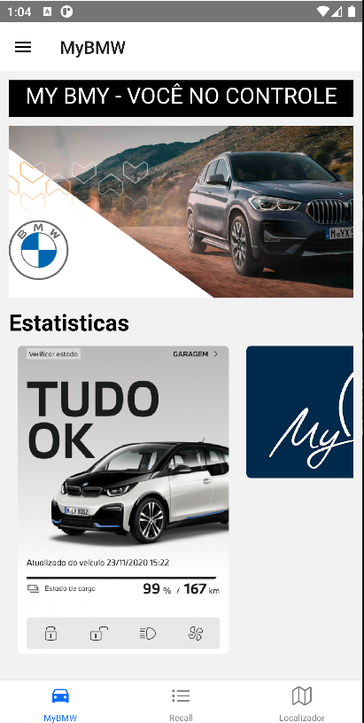
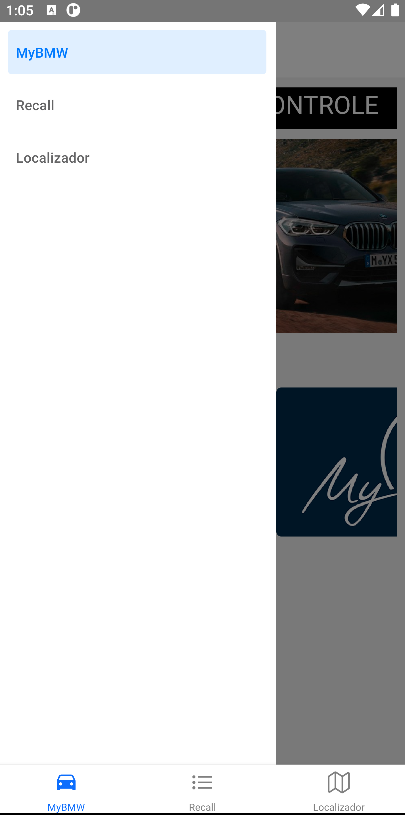
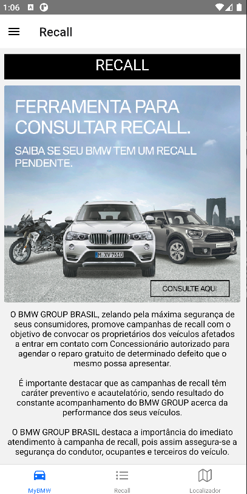
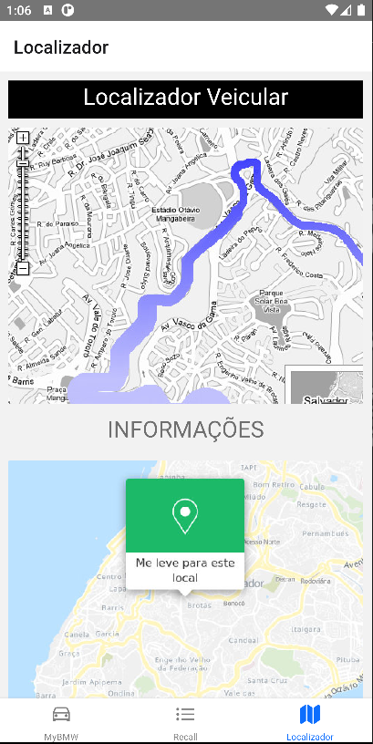

# React Native App MyBMW
App criado para ser uma representação do App Mybmw da BMW utilizando React Native.

 

## Instalação
1. Clone esse repositório ou faça o download dos arquivos
2. Abra o projeto no Visual Studio Code
3. Abra o Terminal e execute o comando `npm install` para instalar os módulos do Node.
4. Use o comando `react-native link` para que todos os assets sejam linkados ao projeto
5. Execute o projeto com `react-native run-android`
6. Enjoy!

<h1>Capturas de tela</h1>

<table>
 <tr>
    <td></td>
    <td></td>
    <td></td>
    <td></td>
  </tr>
</table>

